# Instalação do Sistema Operacional do Raspberry Pi(RPi)

O Raspberry Pi(RPi) precisa de um sistema operacional para funcionar: o [**Raspberry Pi OS**](https://www.raspberrypi.com/software/) (anteriormente chamado de Raspbian). A versão do sistema operacional que utilizaremos está disponível em [https://downloads.raspberrypi.org/raspios_armhf/images/raspios_armhf-2023-05-03/](https://downloads.raspberrypi.org/raspios_armhf/images/raspios_armhf-2023-05-03/).

Se você for utilizar a versão lite, ou seja, sem interface gráfica, baixe a imagem em [https://downloads.raspberrypi.org/raspios_lite_armhf/images/raspios_lite_armhf-2023-05-03/](https://downloads.raspberrypi.org/raspios_lite_armhf/images/raspios_lite_armhf-2023-05-03/) .

## Download da imagem do sistema operacional

Nessa seção vamos baixar a imagem do Raspberry Pi OS e verificar sua integridade no Ubuntu usando o terminal.

O processo consiste em três etapas principais:

1. Baixar a imagem do sistema operacional.  
2. Baixar o arquivo de verificação (checksum SHA256).  
3. Comparar o arquivo baixado com a verificação para garantir que o download não foi corrompido.

### **Passo a Passo no Terminal**

Abra o terminal(o atalho no teclado é `CTRL+ALT+DEL`) do seu computador pessoal e siga os comandos abaixo:

**1\. Baixar a Imagem do Raspberry Pi OS**

Use o comando wget com a opção `-c` (para continuar o download caso seja interrompido) para baixar o arquivo de imagem:
```bash
wget -c https://downloads.raspberrypi.org/raspios_armhf/images/raspios_armhf-2023-05-03/2023-05-03-raspios-bullseye-armhf.img.xz
```
**2\. Baixar o Arquivo de Verificação SHA256**

Em seguida, baixe o arquivo de checksum SHA256, que contém o "código" de verificação do arquivo de imagem original:
```bash
wget https://downloads.raspberrypi.org/raspios_armhf/images/raspios_armhf-2023-05-03/2023-05-03-raspios-bullseye-armhf.img.xz.sha256
```

**3\. Verificar a Integridade do Arquivo**

Agora, use o utilitário sha256sum para gerar o checksum do arquivo de imagem que você baixou e compará-lo com o valor contido no arquivo de verificação.

O comando abaixo faz isso automaticamente:
```bash
sha256sum --check 2023-05-03-raspios-bullseye-armhf.img.xz.sha256
```
#### **Resultados Esperados:**

* **Se o arquivo estiver íntegro**, a saída será:  
```bash
  2023-05-03-raspios-bullseye-armhf.img.xz: SUCESSO
```
  Isso confirma que o download foi concluído com sucesso e o arquivo não está corrompido.  
* **Se o arquivo estiver corrompido**, a saída será algo como:  
```bash
  2023-05-03-raspios-bullseye-armhf.img.xz: FALHOU  
  sha256sum: AVISO: 1 linha está formatada incorretamente  
  sha256sum: AVISO: 1 das 1 somas de verificação calculadas NÃO correspondeu
```
  Nesse caso, você deve apagar o arquivo .img.xz e tentar baixá-lo novamente.

## Instalação do Raspberry Pi Imager

* Agora que temos a imagem do sistema operacional, precisamos gravá-la em um cartão microSD para que o Raspberry Pi possa inicializar a partir dele. O `rpi-mager` é a maneira rápida e fácil de instalar o **Raspberry Pi OS** e outros sistemas operacionais em um cartão microSD. .
* Verifique se o `rpi-mager` está instalado em seu **computador pessoal**, procurando pelo aplicativo conforme ilustrado na figura abaixo. O atalho de teclado para buscar um aplicativo (e outras coisas) no Ubuntu é a tecla `Super`, também conhecida como a tecla `Windows`.

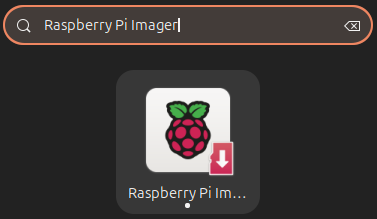

Caso não esteja instalado, siga as instruções abaixo:
  * Conforme as instruções para instalação do *Raspberry Pi Imager*(`rpi-mager`) descritas em  [**site Raspberry Pi software**](https://www.raspberrypi.com/software/), para instalar o `Raspberry Pi Imager` digite a seguinte linha de comando no terminal de seu computador pessoal com Ubuntu:

``` bash
sudo apt update
sudo apt install rpi-imager
```

 ## Instalação do Raspberry Pi OS

* Insira um cartão SD no leitor **do computador pessoal** (ainda não é pra inserir no RPi) e abra a aplicação **Imager** no menu de aplicativos do Ubuntu:  
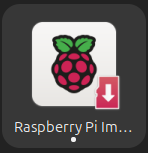
<!--
* Clique no botão para selação do Sistema Operacional (ou Operativo em algumas traduções) e formate o cartão SD antes de instalar o sistema operacional selecionando a opção `Erase-Format card as FAT32` como mostrado na figura abaixo:

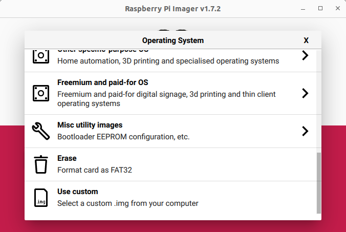
* Clique no botão **Choose Storage**  e selecione a unidade referente ao cartão SD. Depois clique em `Write` e `Yes`.

* Depois de concluída a formatação abra novamente o **rpi-imager**
-->

* Vamos iniciar a instalação do sistema operacional. Em **Rapsberry Pi Device**, escolha **Raspberry Pi 3**. Em **Operating System** escolha a opção **Use Custom**(Utilizar Customizado) e Selecione a imagem `2023-05-03-raspios-bullseye-armhf.img.xz` que gravamos em disco. Essa imagem  é o *Raspberry Pi OS (Legacy, 32-bit)*, um *port* do Debian Bullseye .

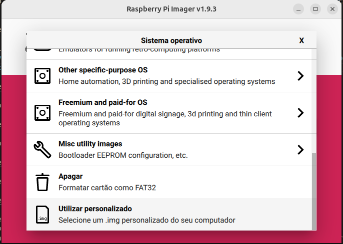

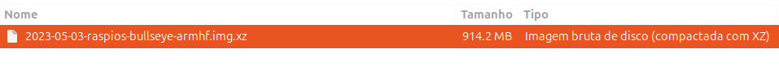

* Clique no botão **Choose Storage**  e selecione a unidade referente ao cartão SD

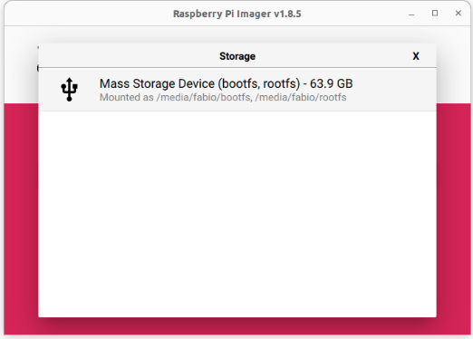

* Clique no botão **Next**

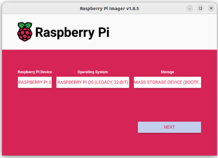

*  Clique em **EDIT SETTINGS**

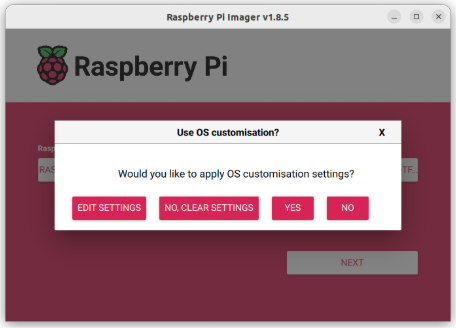

* Selecione as opções conforme a seguir na aba **GENERAL**:  
  * *Set hostname*(nome de anfitrião):   
    * Defina o hostname conforme a sua bancada. Por exemplo, para a bancada 1 o hostname será **rpi1**, para a bancada 2 será **rpi2**.  
  * *Set username and password*(nome de utilizador e palavra-chave)*:*  
    *  Username: **pi**  
    * Password: **pi**  
  * Configure wireless LAN:  
    * SSID: **LabSEA 2.4GHz**  
    * Password:0790b7e1fbc7ffc0292e525f7c041887af3f0fedd14867ae6a50d7efe50a1b99  
  * *Set locale settings*(Definições de idioma e região):  
    * Time zone: America/Sao\_Paulo  
    * Keyboard layout: br

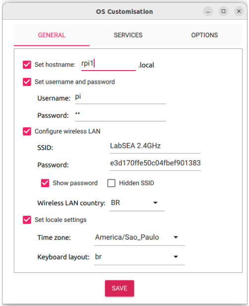

* Na aba **SERVICES**:  
  * Habilite o SSH clicando em *Enable SSH* e clique em *SAVE* para salvar as configurações.

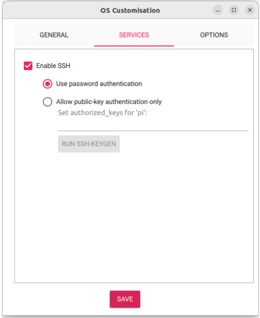

* E, finalmente, inicie a gravação do cartão SD clicando no botão **YES** em duas telas seguidas. 

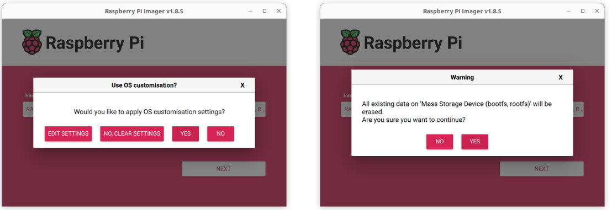

* A senha é solicitada, e começa o processo de instalação. Isso deve demorar alguns minutos **(paciência…)**.

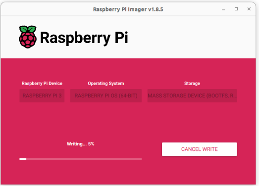

* Quando a instalação é concluída clique em CONTINUAR e remova o cartão SD.

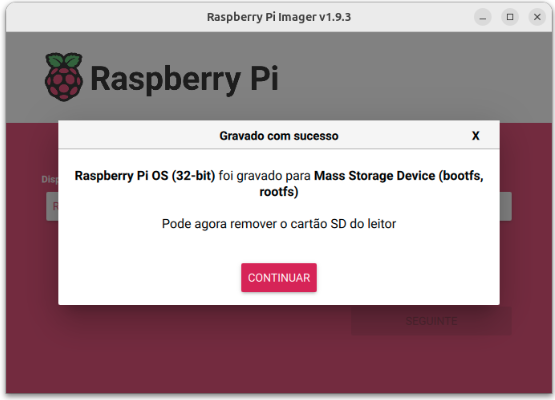

## Configuração de acesso remoto

### Habilitar o servidor VNC no RPi

* Insira o cartão SD no Raspberry Pi 3:

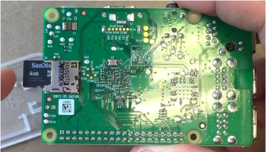

* Conecte a fonte ao conector indicado na figura abaixo:

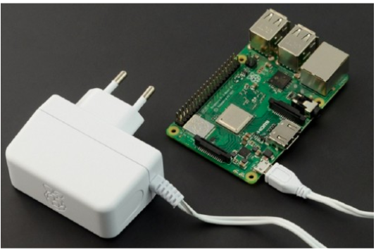

* Abra o terminal clicando em “**Mostrar aplicativos**” no canto inferior esquerdo e abra o “Terminal”.

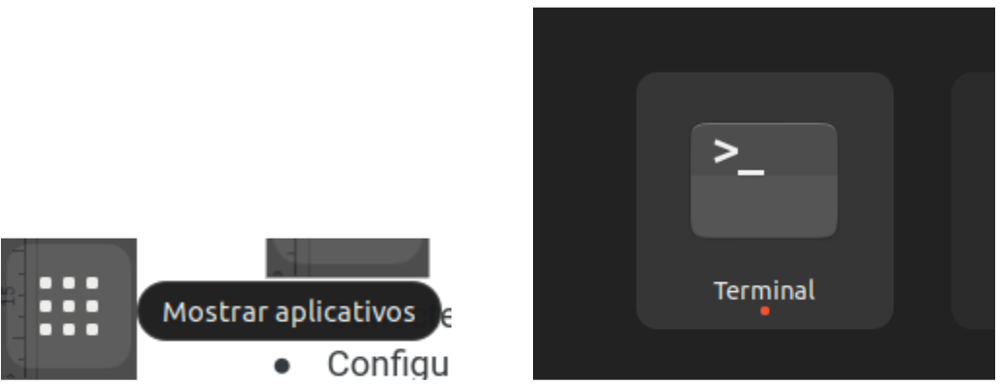

* No terminal digite, substituindo **\<hostname\>** pelo nome de acordo com sua bancada (para a bancada 1, por exemplo, seria `ssh pi@rpi1.local`) 

```bash
ssh pi@<hostname>.local
```

* Responda “yes” se surgir um texto lhe perguntando:

```bash
This key is not known by any other names Are you sure you want to continue connecting (yes/no/[fingerprint])? |
```

* Em seguida forneça a senha `pi` cadastrada no `rpi-mager`:

```bash
pi@<hostname>.local's password:
```

* Em seguida você verá o prompt do terminal parecido com a figura abaixo, indicando que você está conectado com o usuário “pi” no host “rpi1”(o número final depende de seu hostname) :

```bash
pi@rpi1:\~ $
```

* No terminal do RPi digite:
```bash
sudo raspi-config
```

* e na opção 3 Interfacing Options-\>I 3 VNC habilite o servidor VNC.

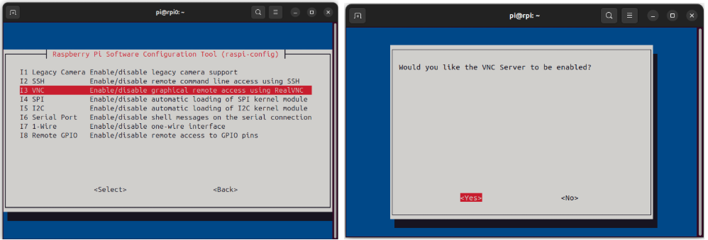


### Instalação do cliente VNC no computador

* Confira se o VNC viewer não está instalado em seu computador pessoal procurando pelo aplicativo conforme ilustrado na figura abaixo. O atalho de teclado para buscar um aplicativo (e outras coisas) no Ubuntu é a tecla `Super`, também conhecida como a tecla `Windows`.
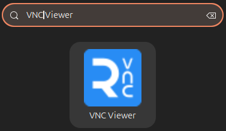
* Caso não esteja instalado, siga as instruções abaixo:
  * Baixe o VNC viewer: [https://www.realvnc.com/pt/connect/download/viewer/linux/](https://www.realvnc.com/pt/connect/download/viewer/linux/)  
  * Instale o VNC viewer com a seguinte linha de comando, substituindo o texto \<VERSÃO DO VNC\> que você baixou(quanto esse tutorial foi escrito era 7.12.1):
  ```bash
  sudo dpkg -i VNC-Viewer-<VERSÃO DO VNC>-Linux-x64.deb
  ```

* Executar o VNC viewer e se conecte em `<hostname>.local`:

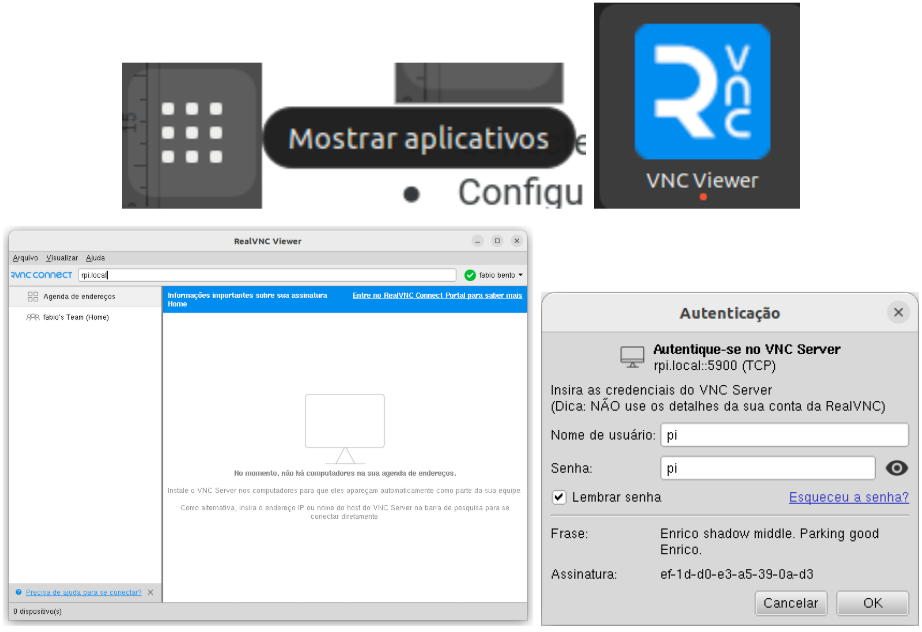

* Agora você tem acesso ao RPi através do monitor de seu computador desktop, sem precisar conectar mouse ou teclado no RPi:

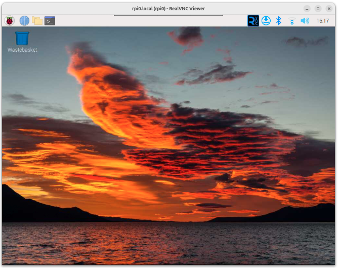

## Verificação da conexão com uma webcam USB

Esta seção mostra como verificar se sua webcam USB está sendo reconhecida pelo sistema e como capturar uma imagem de teste para confirmar seu funcionamento, tudo através da linha de comando.

### **Passo 1: Verifique se a webcam foi detectada**

Antes de instalar qualquer software, vamos garantir que o RPi está "enxergando" a câmera fisicamente.

1. Liste os Dispositivos USB:  
   Conecte a webcam em uma porta USB e execute o seguinte comando no terminal para listar todos os dispositivos USB conectados:  
   ```bash  
   lsusb
   ```
  
   Você deve ver uma linha que descreve sua webcam. O nome pode variar, mas geralmente inclui o fabricante (como Logitech, Microsoft, etc.).  
   * **Exemplo de Saída:**  
    ```bash  
     Bus 001 Device 004: ID 046d:0825 Logitech, Inc. webcam C270
    ```
    Se a câmera aparecer nesta lista, o sistema a reconheceu.

2. Verifique o Dispositivo de Vídeo:  
   O Linux cria um "arquivo de dispositivo" para a câmera, que os programas usam para acessá-la.  Verifique se este arquivo foi criado:  
    ```bash  
   ls /dev/video*
    ```
   * **Saída Esperada:**  
    ```bash  
    /dev/video0   /dev/video12  /dev/video16  /dev/video21
    /dev/video1   /dev/video13  /dev/video18  /dev/video22
    /dev/video10  /dev/video14  /dev/video2   /dev/video23
    /dev/video11  /dev/video15  /dev/video20  /dev/video31

    ```
    Se você vir `/dev/video0` (ou `/dev/video1`, etc.), significa que o driver foi carregado com sucesso e a câmera está pronta para ser usada.

### **Passo 2: Instale a Ferramenta de Captura (fswebcam)**

fswebcam é um utilitário de linha de comando leve e eficaz para capturar imagens de uma webcam.

1. Atualize a Lista de Pacotes:  
   É sempre uma boa prática garantir que sua lista de pacotes esteja atualizada antes de instalar um novo software.  
   ```bash  
   sudo apt update
   ```
2. Instale o fswebcam:  
   Agora, instale a ferramenta com o seguinte comando. A flag \-y confirma automaticamente a instalação.  
   ```bash  
   sudo apt install fswebcam -y
   ```

### **Passo 3: Capture sua Primeira Imagem**

Com a ferramenta instalada, vamos tirar uma foto de teste.

1. Execute o Comando Básico de Captura:  
   Este comando irá capturar uma imagem da sua câmera (`/dev/video0` por padrão) e salvá-la no diretório atual com o nome imagem.jpg.  
   ```bash  
   fswebcam imagem.jpg
   ```  

   O terminal mostrará algumas informações enquanto a captura é realizada. O processo pode levar alguns segundos, pois a ferramenta ignora os primeiros frames para permitir que o sensor da câmera se ajuste à iluminação do ambiente.  
2. Verifique a Imagem:  
   Para ver se funcionou, liste os arquivos no diretório (`ls -lh`) e você verá o arquivo imagem.jpg. Você pode abri-lo usando o visualizador de imagens do seu sistema ou transferi-lo para outro computador.

### **Passo 4 (Opcional): Capture uma Imagem com Mais Qualidade**

Você pode adicionar parâmetros ao comando fswebcam para controlar a qualidade da imagem e outras opções.

1. Capture uma Imagem em Alta Resolução e Sem Banner:  
   O comando abaixo especifica a resolução e remove a faixa de informações (banner) que o fswebcam adiciona por padrão.  
    ```bash  
    fswebcam -r 1280x720 --no-banner imagem_hd.jpg
    ```  
   * `-r 1280x720`: Define a resolução da imagem para 1280x720 pixels (HD 720p). Verifique as especificações da sua câmera para saber quais resoluções ela suporta.  
   * `--no-banner`: Remove a tarja de texto que o fswebcam adiciona na parte inferior da imagem.  
   * `imagem_hd.jpg`: Salva a nova imagem com um nome diferente.

<!--
### **Resumo dos Comandos**

Bash

\# 1\. Verificar hardware  
lsusb  
ls /dev/video\*

\# 2\. Instalar o software  
sudo apt update  
sudo apt install fswebcam \-y

\# 3\. Capturar uma imagem simples  
fswebcam imagem.jpg

\# 4\. Capturar uma imagem com opções personalizadas  
fswebcam \-r 1280x720 \--no-banner imagem\_hd.jpg  
---
-->


## Verificação da conexão com um Módulo de Câmera 2 do RPi

* Podemos utilizar também o [módulo de  câmera 2 do Raspberry Pi](https://www.raspberrypi.com/products/camera-module-v2/).  
* Para **encaixar o módulo de câmera**, desligue o RPi e siga a seção esse tutorial disponível **[nesse link ( no intervalo 2min20seg até 3min22seg do vídeo)](https://youtu.be/y-856jgQdgU?t=139)**.  
* Ligue o RPi  
* No Raspberry Pi OS, abra o terminal através do ícone no canto superior direito.

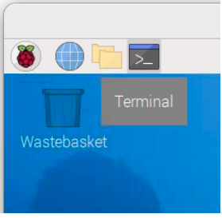

* Verifique se a câmera está sendo reconhecida corretamente:

```bash
libcamera-hello --list-cameras
```

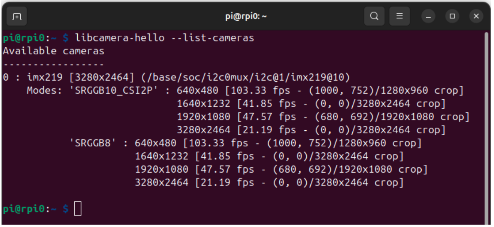

* Faça um teste para verificação do funcionamento da câmera

```bash
libcamera-hello
```

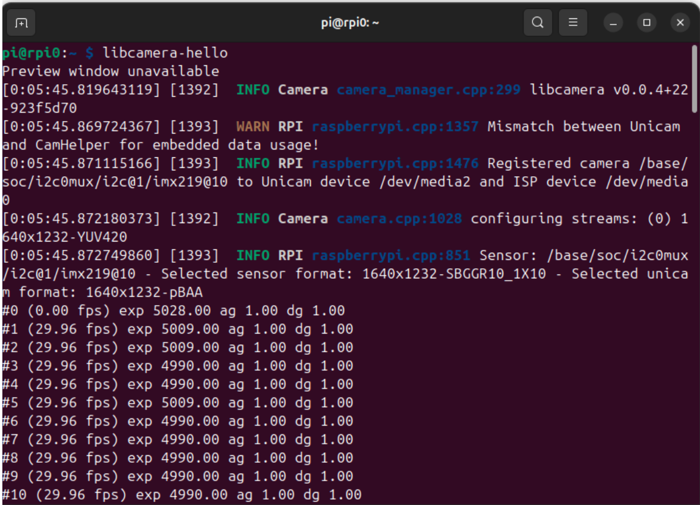

* Para maiores detalhes leia a documentação disponível em:  
  * [https://www.raspberrypi.com/documentation/accessories/camera.html](https://www.raspberrypi.com/documentation/accessories/camera.html)  
  * [https://www.raspberrypi.com/documentation/computers/camera\_software.html](https://www.raspberrypi.com/documentation/computers/camera_software.html)


## Referências

* Principais referências para configuração inicial:   
  * Instalação do sistema operacional:  
    * [https://www.raspberrypi.com/software/](https://www.raspberrypi.com/software/)  
  * Configuração geral do sistema através da ferramenta raspi-config:  
    * [https://www.raspberrypi.com/documentation/computers/configuration.html](https://www.raspberrypi.com/documentation/computers/configuration.html)  
  * Configuração de acesso remoto:  
    * [https://www.raspberrypi.com/documentation/computers/remote-access.htm](https://www.raspberrypi.com/documentation/computers/remote-access.html)

